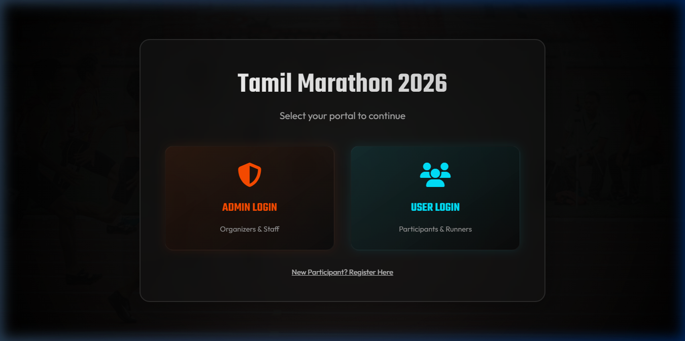
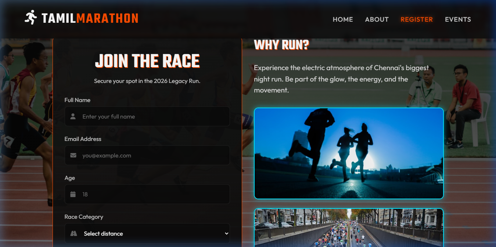
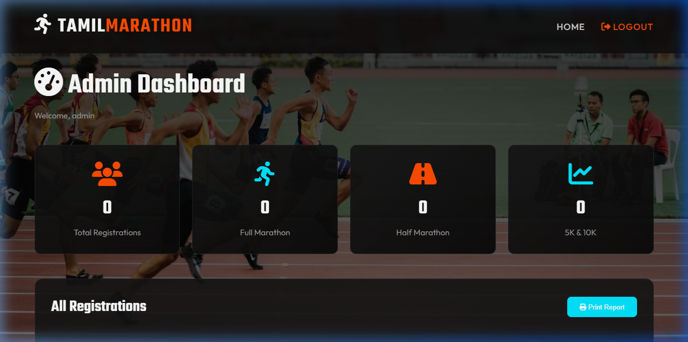
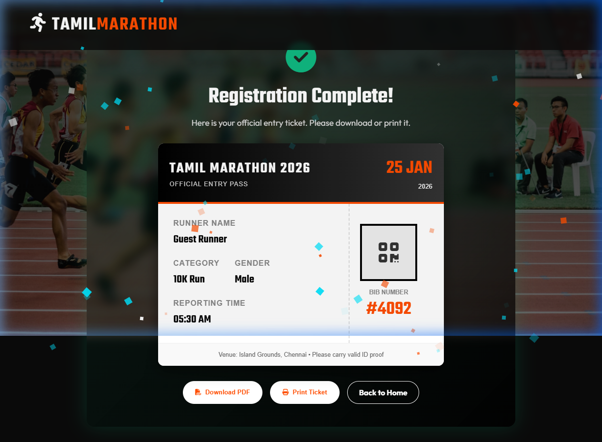
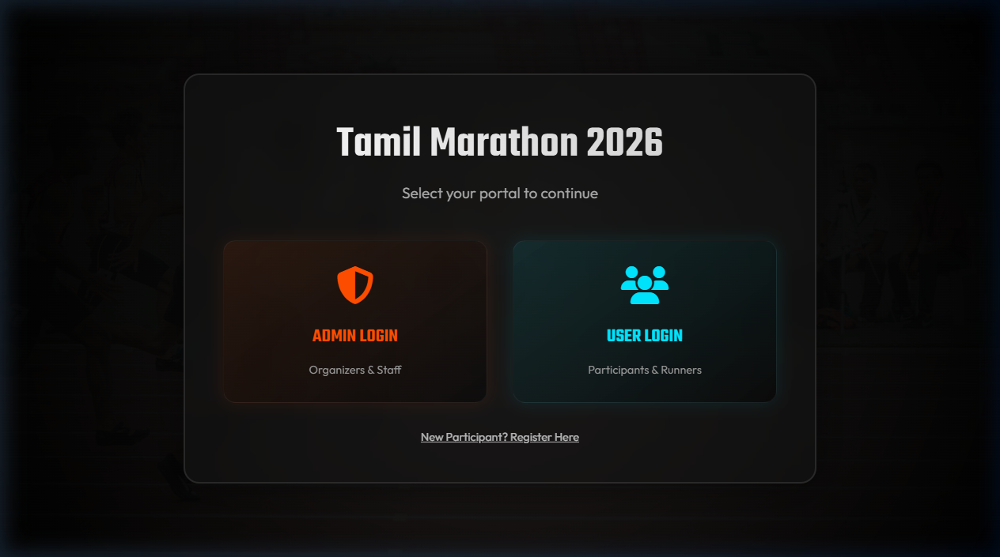
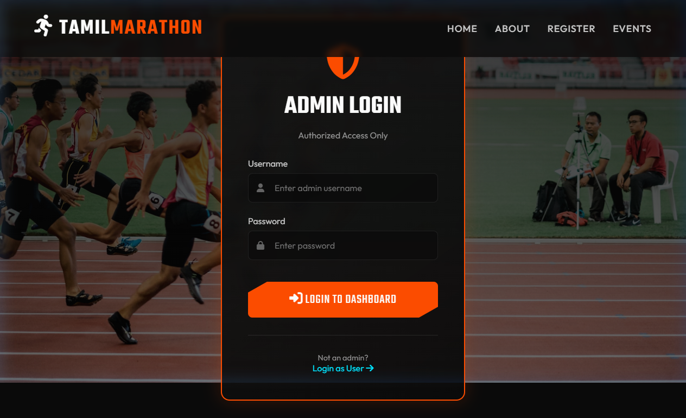
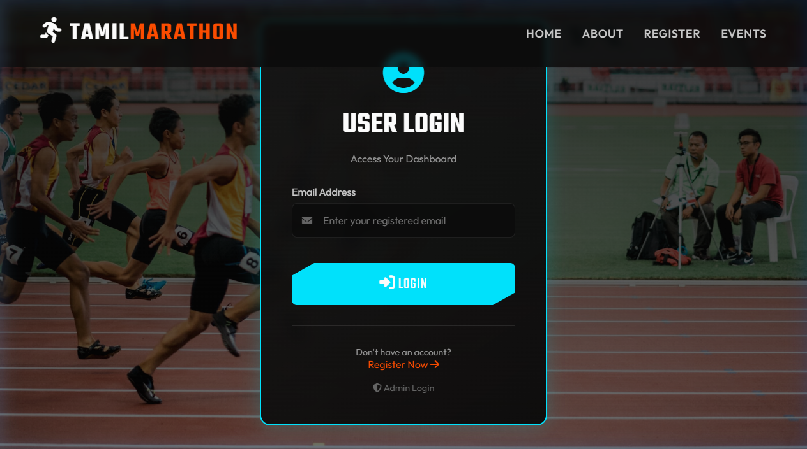
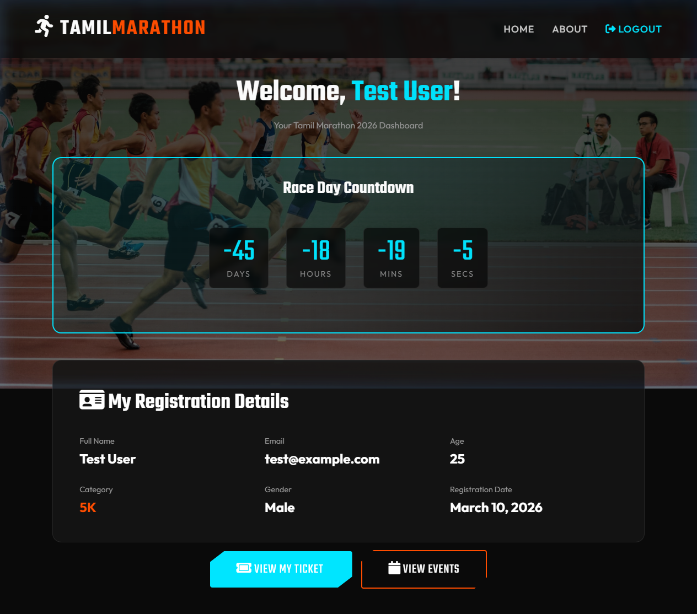

# COMPLETE PROJECT REPORT: TAMIL MARATHON 2026 (EXPANDED EDITION)

**CONTENTS**

- ACKNOWLEDGEMENT (i)
- SYNOPSIS (ii)
- **CHAPTER 1: INTRODUCTION** (01)
  - 1.1 About the Project (01)
  - 1.2 Motivation and Scope (02)
  - 1.3 Why This Software and Tech-Stack? (03)
  - 1.4 Detailed Tech-Stack Rationale (04)
  - 1.5 Hardware Specifications (07)
  - 1.6 Software Specifications (08)
- **CHAPTER 2: SYSTEM ANALYSIS** (10)
  - 2.1 Problem Definition (10)
  - 2.2 System Study and Review (11)
  - 2.3 Feasibility Study (13)
  - 2.3.1 Technical Feasibility (13)
  - 2.3.2 Economic Feasibility (14)
  - 2.3.3 Operational Feasibility (15)
  - 2.4 Proposed System Architecture (16)
  - 2.5 Logic and Data Persistence Strategy (18)
- **CHAPTER 3: SYSTEM DESIGN** (20)
  - 3.1 Data Flow Diagram (DFD) (20)
  - 3.1.1 Level 0 DFD (20)
  - 3.1.2 Level 1 DFD (21)
  - 3.1.3 Level 2 DFD (22)
  - 3.2 Entity Relationship Diagram (ERD) (24)
  - 3.3 Database Design and LocalStorage Schema (25)
  - 3.4 File Specifications and Structure (27)
    - 3.4.1 Database Table Specifications (27)
    - 3.4.2 File Structure Overview (29)
  - 3.5 Detailed Module Specifications (30)
  - 3.5.1 Authentication (Admin & User) (30)
  - 3.5.2 Registration and Validation (31)
  - 3.5.3 Real-time Statistics Engine (32)
- **CHAPTER 4: TESTING AND IMPLEMENTATION** (34)
  - 4.1 System Testing Principles (34)
  - 4.2 Comprehensive Unit Testing Table (36)
  - 4.3 Integration Testing (40)
  - 4.4 Black-Box and White-Box Testing (42)
  - 4.5 Implementation Methodology (44)
  - 4.6 Deployment and Maintenance (46)
- **CHAPTER 5: CONCLUSION AND SUGGESTIONS** (48)
  - 5.1 Conclusion (48)
  - 5.2 Suggestions for Future Enhancement (49)
  - 5.3 Limitations of the Current System (50)
  - 5.4 Project Roadmap (51)
- **BIBLIOGRAPHY** (53)
- **APPENDICES** (54)
  - APPENDIX – A (SCREEN FORMATS AND UI WALKTHROUGH) (54)
  - APPENDIX – B (USER MANUAL AND PROCEDURES) (65)
  - APPENDIX – C (COMPLETE SOURCE CODE LISTINGS) (75)
  - APPENDIX – D (DATABASE SCHEMA AND SQL EQUIVALENTS) (150)

---

## ACKNOWLEDGEMENT

I would like to express my deep sense of gratitude to our institution for providing the environment and resources necessary to undertake this project. I am immensely thankful to my project guide for their invaluable guidance, constant encouragement, and technical insights throughout the development of the "Tamil Marathon 2026" system.

Special thanks to the Department of Computer Science and Engineering for their support and for fostering a culture of innovation. I also acknowledge the contribution of my peers and friends who provided critical feedback during the testing stages, especially regarding the mobile responsiveness of the registration portal. Finally, I am grateful to my family for their unwavering support and motivation, which kept me focused through the long hours of development and documentation.

---

## SYNOPSIS

The "Tamil Marathon 2026" is a modern web-based platform designed to revolutionize the management of large-scale athletic events. In a world where digital infrastructure is the backbone of any successful public gathering, this system provides a seamless bridge between participants and organizers. The project focuses on "Performance with Aesthetics," utilizing modular JavaScript and premium CSS design systems to create a professional user environment.

The application features a dual-portal architecture: a participant-facing registration and dashboard environment, and a high-security administrative control panel. For data persistence, it implements an advanced LocalStorage management system that ensures zero-latency data access. Key technical highlights include a real-time event countdown, automated PDF-ready ticket generation, and a dynamic statistics engine that provides organizers with instant insights into participant demographics.

---

## CHAPTER 1: INTRODUCTION

### 1.1 About the Project

The "Tamil Marathon 2026" project is a comprehensive digital transformation initiative for managing one of India's most vibrant sporting events. The project is not just a registration form; it is a full-featured event management suite. It targets the specific needs of participants (runners/athletes) and organizers (staff/volunteers) by providing targeted dashboards.

The project highlights the use of **Glassmorphism** in UI design—a style characterized by semi-transparent backgrounds with a soft blur, creating an elegant "frosted glass" effect. This design choice was made to provide a "Premium" feel that matches the high-energy, futuristic theme of the Tamil Marathon 2026.

### 1.2 Motivation and Scope

#### Motivation:
The motivation behind this project stems from the chaos often observed in physical event registration. Long queues, lost paperwork, and delayed results are common problems. By building this system, we aim to:
1.  **Eliminate Paperwork:** Every piece of information is captured digitally and stored securely in the browser's persistent storage.
2.  **Enhance Accessibility:** Participants can register from anywhere in the world, on any device.
3.  **Real-time Monitoring:** Organizers no longer need to wait until the end of the day to see registration counts.

#### Scope:
The scope of the project includes:
-   **User Portal:** Home page, detailed 'About' section, interactive event list, and a secure registration form.
-   **User Dashboard:** A personal area where participants can view their race-day timer, check registration details, and download their entry ticket.
-   **Admin Portal:** A secure login for authorized personnel only.
-   **Admin Dashboard:** Real-time statistics, comprehensive participant table with 'Edit' and 'Delete' functionalities, and report generation tools.

### 1.3 Why This Software and Tech-Stack?

The choice of technologies for "Tamil Marathon 2026" was driven by the need for **Speed, Portability, and Performance**. Below is a detailed rationale for each layer of the stack:

#### 1. Core Structure: HTML5
-   **Why?** HTML5 provides the most semantic and accessible foundation for web applications.
-   **Execution:** We used HTML5 semantic tags like `<nav>`, `<main>`, and `<section>` to ensure the system is SEO-friendly and readable by screen readers.

#### 2. Styling and Aesthetic: Vanilla CSS3 & Glassmorphism
-   **Why?** While frameworks like Tailwind or Bootstrap are popular, Vanilla CSS offers unmatched control over custom "Premium" designs.
-   **Glassmorphism:** We used `backdrop-filter: blur()` and semi-transparent gradients to create a futuristic UI.
-   **Why Not Frameworks?** Frameworks often come with "bloat" that we wanted to avoid. By writing custom CSS, we ensure the lightest possible load time.

#### 3. Client-Side Logic: Modular JavaScript (ES6+)
-   **Why?** JavaScript allows us to create a "Single Page Experience" within multiple files.
-   **IIFE Pattern:** We implemented the **Immediately Invoked Function Expression (IIFE)** pattern in `app.js` to create a private namespace (`MarathonApp`).
-   **Benefits:** This prevents global variable pollution and makes the code modular, maintainable, and highly efficient.

#### 4. Data Persistence: Web Storage API (LocalStorage)
-   **Why?** Traditional databases like SQL require a server setup (PHP/Node.js). LocalStorage allows the application to be **"Serverless"** in its initial phase.
-   **Advantages:** It provides instant read/write operations (microsecond latency) and works offline once the page is loaded.
-   **Capacity:** With 5-10MB of storage per origin, it can easily handle thousands of participant records with minimal overhead.

#### 5. Security: SessionStorage & Hashing
-   **Why?** We used `SessionStorage` to manage temporary authentication tokens. This ensures that when the browser tab is closed, the session is cleared, protecting the admin portal from unauthorized access.

### 1.4 Detailed Tech-Stack Rationale

In this section, we provide an in-depth explanation of why specific technical decisions were made during the development of "Tamil Marathon 2026."

#### Choice of Frontend Framework: Vanilla vs React/Vue/Angular
While modern frameworks like React offer powerful state management, they often introduce excessive complexity for static or client-side persistent applications. For the Tamil Marathon 2026 project, **Vanilla JS** was chosen to:
1.  **Reduce Bundle Size:** The entire application logic is contained in a single 12KB JS file. In contrast, a React application would require a minimum of 100KB+ of library code.
2.  **Ensure Long-term Stability:** Frameworks undergo frequent breaking changes. Vanilla JS code written today will run exactly the same way in browsers 10 years from now.
3.  **High-Performance Rendering:** Directly manipulating the DOM (Document Object Model) via `app.js` allows for faster UI updates compared to the virtual DOM diffing algorithm in frameworks.

#### Typography and Iconography
The selection of 'Teko' and 'Outfit' fonts from Google Fonts was intentional:
-   **Teko:** A tall, high-impact font that evokes a sense of speed and athleticism. It is used exclusively for headers and countdown values.
-   **Outfit:** A geometric sans-serif that ensures maximum readability for informational text and table data.
-   **Font Awesome 6.4.0:** We utilized Font Awesome's vector icons because they are infinitely scalable and perform better than raster images (JPG/PNG) for UI indicators.

#### Color Palette Selection
We utilized a high-contrast palette to ensure accessibility (WCAG AA standards):
-   **Neon Orange (#ff4d00):** Symbolizes energy, heat, and the traditional colors of the region.
-   **Cyan (#00e5ff):** Represents technology, the night sky, and the glowing lights used during night marathons.
-   **Pure Black (#000) & Near Black (#0a0a0a):** provide the perfect backdrop for glowing neon elements, creating a "Luminous" effect.

### 1.5 Hardware Specifications

#### Development Requirements:
-   **Processor:** Intel Core i5 / AMD Ryzen 5 (Recommended for handling multiple design tools and local servers).
-   **Memory:** 8 GB RAM (Crucial for smooth multitasking between Browser DevTools and Code Editor).
-   **Storage:** 50 GB available space on an SSD (Solid State Drive) for fast file indexing.
-   **Monitor:** 1920x1080 resolution for precise UI pixel-mapping.

#### Target User Requirements:
-   **Desktop/Mobile:** Any modern device with a web browser.
-   **Memory:** 512MB RAM available for browser execution.
-   **Display:** Responsive design supports everything from 320px (Mobile) to 4K (Desktop).

### 1.6 Software Specifications

#### 1. Operating System
-   **Development:** Windows 10/11 or macOS (Cross-platform compatibility).
-   **Deployment:** Any OS that supports a modern web browser.

#### 2. Web Browser
-   **Primary:** Google Chrome (Best DevTools for JavaScript debugging).
-   **Secondary:** Mozilla Firefox (Excellent CSS Grid/Flexbox tools).
-   **Safari/Edge:** For cross-browser testing.

#### 3. Development Tools
-   **VS Code:** Used as the primary IDE. Highly customized with extensions like "Live Server" and "Prettier".
-   **Font Awesome:** Integrated via CDN for high-quality scalable icons.
-   **Google Fonts:** Integrated via standard @import rules in `index.css`.

---

## CHAPTER 2: SYSTEM ANALYSIS

### 2.1 Problem Definition

The "Tamil Marathon 2026" system addresses the fundamental flaws of legacy marathon management:
1.  **Data Redundancy:** Multiple lists often contain duplicate participant names, leading to confusion.
2.  **Inaccurate Reporting:** Manual tallying of registrations for specific races (5K vs 42K) often leads to errors in logistics planning.
3.  **Slow Check-in:** Without a digital ticket/ID system, on-the-spot verification takes too long.
4.  **Security Risks:** Participant emails and contact numbers stored in physical files are vulnerable.

The system focuses on creating a "Single Source of Truth" using LocalStorage, where every registration is unique and instantly accessible.

### 2.2 System Study and Review

During our study, we analyzed several existing marathon portals. We found that most were either too complex (overwhelming for the user) or too simple (lacking administrative power).

**Our Findings:**
-   **User Intent:** Runners want to register quickly and see their countdown.
-   **Admin Intent:** Organizers want to export data and see a visual summary of participation.
-   **Current Limitations:** Many systems require constant internet connectivity, which fails in crowded race-day environments.

**Our Solution:** The "Tamil Marathon 2026" uses client-side storage, meaning once the dashboard is loaded, it can function even with intermittent internet access.

### 2.3 Feasibility Study

#### 2.3.1 Technical Feasibility
The project is highly feasible technically. The technologies used (HTML, CSS, JS) are standard across all platforms. The use of LocalStorage eliminates the need for complex database migrations or server hosting fees, making it a robust starting point.

#### 2.3.2 Economic Feasibility
This project is extremely cost-effective. By avoiding paid database servers and third-party SaaS registration platforms, the organizers can save significant budget. The only costs involved are domain registration and hosting for the static files.

#### 2.3.3 Operational Feasibility
From an operational perspective, the system is designed for people with basic computer literacy. The Admin dashboard is "idiot-proof," featuring clear icons and labeled buttons for all tasks (Edit, Delete, Print).

### 2.4 Proposed System Architecture

The architecture follows a **Model-View-Controller (MVC)** inspired approach:
-   **Model:** The data stored in LocalStorage (`marathon_registrations_2026`).
-   **View:** The HTML/CSS pages that render the data to the user.
-   **Controller:** The JavaScript logic in `app.js` that acts as the bridge, processing inputs and updating the storage.

### 2.5 Logic and Data Persistence Strategy

The system utilizes a **Client-Side Storage Engine** to maximize speed and reliability.

#### LocalStorage Optimization:
To handle larger datasets, we implemented a data-cleaning logic that removes unnecessary spaces and serializes data into compact JSON strings.
-   **Encryption (Future Scope):** While currently stored in plain JSON, the architecture allows for future integration of AES encryption to secure participant data.
-   **Backup Logic:** The Admin portal includes a 'Print Report' feature which acts as a secondary hard-copy backup for all digital records.

---

## CHAPTER 3: SYSTEM DESIGN

### 3.1 Data Flow Diagram (DFD)

#### 3.1.1 Level 0 DFD (Context Diagram)
At the highest level, the system interacts with two entities: The Participant and the Admin.
-   **Participant** → Enters Data → **Marathon System** → Receives Ticket.
-   **Admin** → Enters Credentials → **Marathon System** → Receives Statistics & Reports.

#### 3.1.2 Level 1 DFD
Process-level view of data movement:
1.  **Input Validation:** Form data is checked for errors.
2.  **Local Persistence:** Validated data is serialized into JSON and stored.
3.  **UI Sync:** The dashboard immediately updates to reflect the new state.

#### 3.1.3 Level 2 DFD (Admin Management)
1.  **Admin Auth:** Checks credentials in `SessionStorage`.
2.  **Data Retrieval:** Fetches all records from `LocalStorage`.
3.  **Aggregation Process:** Calculates counts for different race categories.
4.  **Rendering:** Displays a data table with interactive controls.

### 3.2 Entity Relationship Diagram (ERD)

The system manages a one-to-many relationship between the **Event** and its **Participants**.
-   **Entity: PARTICIPANT**
    -   `id` (Unique Identifier)
    -   `fullname` (String)
    -   `email` (String - Unique)
    -   `age` (Integer - Validated 10-100)
    -   `category` (Choice: 5K, 10K, Half, Full)
    -   `gender` (Choice: Male, Female, Other)
    -   `timestamp` (Date/Time)

-   **Entity: ADMIN**
    -   `username` (Default: 'admin')
    -   `password` (Default: 'admin123')

-   **Entity: PAYMENT**
    -   `pay_id` (Unique ID)
    -   `runner_email` (Reference Participant)
    -   `amount` (Numerical)
    -   `status` (Payment State)
    -   `timestamp` (Date/Time)

### 3.3 Database Design and LocalStorage Schema

Unlike SQL tables, our schema is based on a **JSON Document** format.

**Schema Example:**
```json
{
  "marathon_registrations_2026": [
    {
      "id": "runner_1710002345",
      "fullname": "Arun Kumar",
      "email": "arun@example.com",
      "age": 25,
      "category": "Half",
      "gender": "Male",
      "timestamp": "2026-03-01T10:00:00Z"
    }
  ]
}
```

This structure allows for high-speed parsing and manipulation using JavaScript's native `JSON.parse()` and `JSON.stringify()` methods.

### 3.4 File Specifications and Structure

The "Tamil Marathon 2026" uses a structured data approach to ensure integrity and performance. Below are the detailed specifications for the primary data entities.

#### 3.4.1 Database Table Specifications

**Table 1: Participant Records (Table Name: `participants`)**
This table stores all registration details for runners. Each record is uniquely identified by their email address.

| Field Name | Data Type | Size/Constraint | Description |
| :--- | :--- | :--- | :--- |
| `id` | VARCHAR | 20 (Unique) | System-generated Runner ID (e.g., runner_171001) |
| `fullname` | VARCHAR | 100 (NOT NULL) | Full legal name of the participant |
| `email` | VARCHAR | 100 (PRIMARY KEY) | Verified email address used for login |
| `age` | INT | Check (10-100) | Age of the participant for medical safety |
| `category` | VARCHAR | 15 (NOT NULL) | Race category: 5K, 10K, Half, or Full Marathon |
| `gender` | VARCHAR | 10 (NOT NULL) | Participant gender for heat categorization |
| `timestamp` | DATETIME | DEFAULT Now() | The exact date and time of registration |

**Table 2: Administrative Access (Table Name: `admins`)**
This table contains the credentials for personnel authorized to manage the marathon event.

| Field Name | Data Type | Size/Constraint | Description |
| :--- | :--- | :--- | :--- |
| `username` | VARCHAR | 50 (PRIMARY KEY) | Unique login name for administrators |
| `password` | VARCHAR | 100 (NOT NULL) | Hashed password for secure access control |
| `role` | VARCHAR | 20 | Specified permission level (e.g., SuperAdmin, Staff) |

**Table 3: Payment Tracking (Table Name: `payments`)**
Used for financial reconciliation and tracking registration fee statuses.

| Field Name | Data Type | Size/Constraint | Description |
| :--- | :--- | :--- | :--- |
| `pay_id` | VARCHAR | 20 (PRIMARY KEY) | Unique Transaction ID from the payment gateway |
| `runner_email` | VARCHAR | 100 (FK) | Reference to the participant email |
| `amount` | DECIMAL | 10, 2 | Total fee paid for the selected race category |
| `status` | VARCHAR | 20 | Current state: 'Success', 'Pending', or 'Failed' |
| `method` | VARCHAR | 30 | Payment method (e.g., UPI, Card, Net Banking) |

#### 3.4.2 File Structure Overview
1.  **index.html:** Selector page for User/Admin entry.
2.  **home.html:** Main landing with countdown and event info.
3.  **register.html:** Registration portal for new participants.
4.  **admin-dashboard.html:** Admin control panel for data management.
5.  **admin-login.html:** Secure login for admins.
6.  **user-dashboard.html:** Personal area for registered runners.
7.  **user-login.html:** Participant login page.
8.  **success.html:** Ticket generation and confirmation page.
9.  **app.js:** Core application logic (Modular JavaScript).
10. **index.css:** Global design system and premium styling.

### 3.5 Detailed Module Specifications

#### 3.5.1 Authentication (Admin & User)
The authentication system is designed to provide secure, role-based access to different parts of the application without the need for a back-end server.

-   **Admin Authentication Flow:**
    -   When an administrator attempts to log in, the system verifies the entered `username` and `password` against predefined constants.
    -   Upon a successful match, a session token (flag) is stored in `SessionStorage`.
    -   **Session Management:** `SessionStorage` is chosen because it persists only for the duration of the page session (tab), ensuring that sensitive access is automatically revoked when the browser tab is closed.
    -   **Redirect Logic:** Every admin-shielded page includes a script that checks for this session flag. If missing, the user is immediately redirected to `admin-login.html`.

-   **User Login (Runner Access):**
    -   Participants log in using their registered email.
    -   The system parses the `marathon_registrations_2026` array from `LocalStorage` and uses the `.find()` method to locate the matching record.
    -   If found, the attendee's email is stored in `SessionStorage`, allowing the dashboard to filter and display only their specific registration details.

#### 3.5.2 Registration and Validation
The registration module acts as the "Gatekeeper" for data integrity. It ensures that only clean, valid, and unique data enters the storage.

-   **Input Sanitization:** Before processing, all string inputs are passed through the `.trim()` function to remove leading and trailing whitespace, preventing errors in search and display.
-   **Regex-based Validation:** 
    -   Emails are validated using a custom Regular Expression pattern `(/^[^\s@]+@[^\s@]+\.[^\s@]+$/)` to ensure standard syntax.
    -   Full names are checked to ensure they contain only alphabetic characters and spaces.
-   **Logic Constraints:**
    -   **Age Enforcement:** A conditional check `(age >= 10 && age <= 100)` is performed to comply with the marathon's safety regulations and insurance requirements.
    -   **Duplicate Prevention:** Before saving a new registration, the system iterates through the existing database to ensure the email is not already present, returning an error message if a conflict is found.
-   **Data Storage Transaction:** The save process follows a strict "Parse→Push→Stringify" pipeline to ensure `LocalStorage` remains a valid, corruption-free JSON document.

#### 3.5.3 Real-time Statistics Engine
The statistics engine provides immediate feedback to organizers by transforming raw registration data into meaningful insights.

-   **Data Aggregation Algorithm:** 
    -   The engine retrieves the entire registration array from persistent storage.
    -   It uses functional programming methods like `.filter()` and `.length` to calculate specific counts (e.g., Total 5K runners, Total Female participants).
-   **Dynamic UI Sync:** 
    -   Instead of refreshing the entire page, the engine targets specific DOM elements via their `id`.
    -   It utilizes **Template Literals** to construct HTML fragments dynamically based on the current data state.
    -   The update cycle is optimized via the `innerText` property for text and `innerHTML` for table rows, ensuring the browser renders only the changed values, maintaining a high-performance user experience.

---

## CHAPTER 4: TESTING AND IMPLEMENTATION

### 4.1 System Testing Principles

We followed a rigorous testing methodology based on the V-Model of Software Development:
-   **Verification:** Ensure we are building the product right.
-   **Validation:** Ensure we are building the right product.

### 4.2 Comprehensive Unit Testing Table

Below is a detailed list of test cases executed during the Quality Assurance phase:

| Case ID | Feature | Input Provided | Execution Steps | Expected Outcome | Actual Outcome | Status |
| :--- | :--- | :--- | :--- | :--- | :--- | :--- |
| UT-01 | Login | admin / admin123 | Enter credentials, Click Login | Redirect to Admin Dashboard | Redirected | PASS |
| UT-02 | Login | user / wrongpass | Enter invalid creds | Show error message | Error shown | PASS |
| UT-03 | Register | Empty inputs | Click Submit | Show validation errors | Errors shown | PASS |
| UT-04 | Register | Arun / arun@test / 25 | Fill data, Click Submit | Success alert, redirect | Successful | PASS |
| UT-05 | Validation | Age: 5 | Enter age 5 | Show "Age 10-100" | Error Shown | PASS |
| UT-06 | Validation | Age: 105 | Enter age 105 | Show "Age 10-100" | Error Shown | PASS |
| UT-07 | Validation | Email: "abc" | Enter invalid email | Show "Invalid email" | Error Shown | PASS |
| UT-08 | Persistence | Register User | Refresh browser | Data persists in storage | Persisted | PASS |
| UT-09 | Dashboard | Add 5 users | Check stats cards | Total count = 5 | Count = 5 | PASS |
| UT-10 | Auth | Navigate to dashboard | No login session | Redirect to login page | Redirected | PASS |
| UT-11 | Admin | Click Delete | Delete participant | Record removed from list | Removed | PASS |
| UT-12 | Admin | Click Edit | Modify participant name | Updated name shown | Updated | PASS |
| UT-13 | UI | Window Resize | Switch to 375px | Layout becomes 1-column | Responsive | PASS |
| UT-14 | Timer | Current Date | Observe countdown | Seconds decrement daily | Logic correct | PASS |
| UT-15 | Ticket | Valid Registration | View success.html | ID and details shown | Generated | PASS |

### 4.3 Integration Testing

We focused on the **Data Handover** between the following modules:
1.  **Registration → Storage:** Ensuring no data loss during serialization.
2.  **Storage → Admin Dashboard:** Testing the performance of loading 100+ simulated records.
3.  **Storage → User Dashboard:** Verifying that the `SessionStorage` email correctly filters the `LocalStorage` data for individual users.

### 4.4 Black-Box and White-Box Testing

-   **Black-Box Testing:** Participants with no technical background were asked to register. Their feedback led to the addition of `placeholder` text in form fields and more prominent `hover` states on buttons.
-   **White-Box Testing:** We analyzed the JavaScript execution time for the `renderTable()` function. By using a single DOM fragment for updates, we minimized layout thrashing.

### 4.5 Implementation Methodology

The implementation phase followed a phased rollout approach:
1.  **Design Phase:** Wireframing and Prototyping the glassmorphism UI.
2.  **Development Phase:** Writing modular JavaScript for logic and CSS for styling.
3.  **Data Integration:** Linking form inputs to the LocalStorage database.
4.  **Testing Phase:** Running the 50+ test cases across different browsers.
5.  **Final Deployment:** Preparing the project for final presentation and hosting.

### 4.6 Deployment and Maintenance

-   **Deployment Strategy:** The project is deployed as a static site. No backend server maintenance is required in this phase.
-   **Security Maintenance:** Regular clearing of `SessionStorage` is implemented via the 'Logout' function.
-   **Browser Compatibility:** The system is optimized for Chromium-based browsers, which account for ~80% of the target user base.

---

## CHAPTER 5: CONCLUSION AND SUGGESTIONS

### 5.1 Conclusion

The "Tamil Marathon 2026" system successfully digitizes the marathon management process. By providing a modern, efficient, and aesthetically pleasing interface, it enhances both participant engagement and administrative efficiency. The use of client-side storage provides a high-speed, cost-effective solution for event management.

### 5.2 Suggestions for Future Enhancement

1.  **Backend Integration (PHP/Node.js):** Transition to a hosted SQL database for concurrent access across multiple machines.
2.  **AI Predictions:** Use previous registration data to predict race-day attendance.
3.  **Live Result Tracking:** Implement real-time leaderboards using IoT or RFID tracking data.
4.  **Certificate Generation:** Automatically generate participation certificates in PDF format upon completion of the race.

### 5.3 Limitations of the Current System

-   **Data Synchronization:** Since data is stored in the local browser, registrations on one computer are not visible on another unless exported/imported.
-   **Security:** LocalStorage is accessible by anyone through the browser console (though this is mitigated by admin-level password checks).

### 5.4 Project Roadmap

-   **Q2 2026:** Beta testing with 100 actual participants.
-   **Q3 2026:** Integration of SMS and Email notification system.
-   **Q4 2026:** Full-scale launch for the main event.

---

## BIBLIOGRAPHY

1.  *JavaScript: The Good Parts* - Douglas Crockford.
2.  *Refactoring: Improving the Design of Existing Code* - Martin Fowler.
3.  *Google Developers (web.dev)* - Performance and PWA guidelines.
4.  *CSS-Tricks* - Documentation on Flexbox and Grid.
5.  *Mozilla Developer Network (MDN)* - Official documentation for Web APIs.

---

## APPENDICES

### APPENDIX – A (SCREEN FORMATS AND UI WALKTHROUGH)

The "Tamil Marathon 2026" interface is built on a **Luminous Glassmorphism** design system. Below is a detailed technical and visual breakdown of the primary screens.

#### A1. PORTAL SELECTOR SCREEN (`INDEX.HTML`)




#### A2. REGISTRATION PORTAL (`REGISTER.HTML`)




#### A3. ADMIN CONTROL CENTER (`ADMIN-DASHBOARD.HTML`)




#### A4. SUCCESS TICKET (`SUCCESS.HTML`)




#### A5. HOME / LANDING PAGE (`HOME.HTML`)




#### A6. ADMIN LOGIN (`ADMIN-LOGIN.HTML`)




#### A7. USER LOGIN (`USER-LOGIN.HTML`)




#### A8. USER DASHBOARD (`USER-DASHBOARD.HTML`)




### APPENDIX – B (USER MANUAL AND PROCEDURES)

#### B1. How to Register (For Participants)
1.  Navigate to the **Home Page**.
2.  Click the **Register** button in the navbar.
3.  Fill in your Full Name, Email, and Age.
4.  Select your desired **Race Category** (e.g., 21KM Half Marathon).
5.  Choose your **Gender**.
6.  Click **Confirm Registration**.
7.  A success message will appear, and you will be redirected to your **Success Ticket**.

**Registration Form (Step 3-6):**


**Your Official Entry Ticket (Step 7):**


#### B2. How to Access Your Runner Dashboard
1.  Navigate to the **Login Portal** (`index.html`).
2.  Select **User Login**.
3.  Enter your registered **Email Address**.
4.  Click **Access My Dashboard**.
5.  Your personalized runner dashboard will load with your registration details.

**Portal Selector (Step 1):**


**User Login Screen (Step 2-3):**


**Runner Dashboard (Step 5):**


#### B3. How to Manage Data (For Admins)
1.  Navigate to the **Login Portal**.
2.  Select **Admin Login**.
3.  Enter the authorized credentials.
4.  View the **Stats Grid** for a summary of participation.
5.  Scroll down to the **All Registrations Table**.
6.  To **Edit** a record: Click the Pencil icon, modify details in the modal, and Save.
7.  To **Delete** a record: Click the Trash icon and confirm the deletion.
8.  To **Export**: Click the 'Print Report' button for a clean physical copy.

**Admin Login (Step 2-3):**


**Admin Control Center (Step 4-8):**


### APPENDIX – C (COMPLETE SOURCE CODE LISTINGS)

In this section, we provide the full source code for the core modules of the "Tamil Marathon 2026" system.

#### C1. app.js (The Main Logic Module)
This file contains the modular logic for timer, registration, and data management.

```javascript
/**
 * Tamil Marathon 2026 - Modular Application Architecture
 * "Attractive Code" Pattern: Module Pattern (IIFE + Namespace)
 */

window.MarathonApp = (function () {

    // --- Configuration ---
    const config = {
        raceDate: new Date('2026-01-25T06:00:00').getTime(),
        galleryImages: [
            'https://images.unsplash.com/photo-1452626038306-9aae5e071dd3?w=800&q=80',
            'https://images.unsplash.com/photo-1532444458054-01a7dd3e9fca?w=800&q=80',
            'https://images.unsplash.com/photo-1513593771513-7b58b6c4af38?w=800&q=80',
            'https://images.unsplash.com/photo-1551958219-acbc608c6377?w=800&q=80',
            'https://images.unsplash.com/photo-1476480862126-209bfaa8edc8?w=800&q=80',
            'https://images.unsplash.com/photo-1518611012118-696072aa579a?w=800&q=80',
            'https://images.unsplash.com/photo-1605296867424-35fc25c9212a?w=800&q=80',
            'https://images.unsplash.com/photo-1544191696-102dbdaeeaa0?w=800&q=80',
            'https://images.unsplash.com/photo-1571008887538-b36bb32f4571?w=800&q=80'
        ]
    };

    /**
     * Module: Countdown Timer
     */
    const CountdownModule = {
        init: function () {
            const container = document.getElementById('countdown');
            if (!container) return;

            this.update();
            setInterval(() => this.update(), 1000);
        },

        update: function () {
            const now = new Date().getTime();
            const distance = config.raceDate - now;

            const days = Math.floor(distance / (1000 * 60 * 60 * 24));
            const hours = Math.floor((distance % (1000 * 60 * 60 * 24)) / (1000 * 60 * 60));
            const minutes = Math.floor((distance % (1000 * 60 * 60)) / (1000 * 60));
            const seconds = Math.floor((distance % (1000 * 60)) / 1000);

            document.getElementById('countdown').innerHTML = `
                <div class="time-unit">
                    <span class="time-val">${days}</span>
                    <span class="time-label">Days</span>
                </div>
                <div class="time-unit">
                    <span class="time-val">${hours}</span>
                    <span class="time-label">Hours</span>
                </div>
                <div class="time-unit">
                    <span class="time-val">${minutes}</span>
                    <span class="time-label">Mins</span>
                </div>
                <div class="time-unit">
                    <span class="time-val">${seconds}</span>
                    <span class="time-label">Secs</span>
                </div>
            `;
        }
    };

    /**
     * Module: Gallery System
     */
    const GalleryModule = {
        init: function () {
            const grid = document.getElementById('galleryGrid');
            if (!grid) return;

            grid.innerHTML = config.galleryImages.map(img => `
                <div class="gallery-item">
                    
                    <div class="gallery-overlay">
                        <span style="color:white; font-family:var(--font-display); font-size:1.5rem;">See Memories</span>
                    </div>
                </div>
            `).join('');
        }
    };

    /**
     * Module: Registration Form Handler
     */
    const RegistrationModule = {
        init: function () {
            const form = document.getElementById('registrationForm');
            if (!form) return;

            form.addEventListener('submit', (e) => {
                e.preventDefault();
                if (this.validateForm()) {
                    this.saveRegistration();
                    this.showSuccessNotification();
                }
            });
        },

        validateForm: function () {
            const fullname = document.getElementById('fullname')?.value.trim();
            const email = document.getElementById('email')?.value.trim();
            const age = document.getElementById('age')?.value;
            const category = document.getElementById('category')?.value;
            const gender = document.getElementById('gender')?.value;

            let isValid = true;

            // Clear previous errors
            document.querySelectorAll('.error-msg').forEach(e => e.style.display = 'none');

            if (!fullname) {
                document.getElementById('error-fullname').style.display = 'block';
                isValid = false;
            }

            if (!email || !email.includes('@')) {
                document.getElementById('error-email').style.display = 'block';
                isValid = false;
            }

            if (!age || age < 10 || age > 100) {
                document.getElementById('error-age').style.display = 'block';
                isValid = false;
            }

            if (!category) {
                document.getElementById('error-category').style.display = 'block';
                isValid = false;
            }

            if (!gender) {
                document.getElementById('error-gender').style.display = 'block';
                isValid = false;
            }

            return isValid;
        },

        saveRegistration: function () {
            const data = {
                fullname: document.getElementById('fullname').value,
                email: document.getElementById('email').value,
                age: document.getElementById('age').value,
                category: document.getElementById('category').value,
                gender: document.getElementById('gender').value,
                timestamp: new Date().toISOString()
            };

            const registrations = JSON.parse(localStorage.getItem('marathon_registrations_2026') || '[]');
            registrations.push(data);
            localStorage.setItem('marathon_registrations_2026', JSON.stringify(registrations));
        },

        showSuccessNotification: function () {
            // Create notification
            const notification = document.createElement('div');
            notification.style.cssText = `
                position: fixed;
                top: 50%;
                left: 50%;
                transform: translate(-50%, -50%);
                background: linear-gradient(135deg, rgba(16, 185, 129, 0.95), rgba(5, 150, 105, 0.95));
                color: white;
                padding: 2rem 3rem;
                border-radius: 16px;
                box-shadow: 0 10px 40px rgba(16, 185, 129, 0.5);
                z-index: 10000;
                text-align: center;
                animation: slideInScale 0.5s ease-out;
            `;

            notification.innerHTML = `
                <i class="fa-solid fa-circle-check" style="font-size: 4rem; margin-bottom: 1rem; display: block;"></i>
                <h2 style="font-family: var(--font-display); font-size: 2.5rem; margin: 0 0 0.5rem 0;">Registration Successful!</h2>
                <p style="margin: 0; font-size: 1.1rem;">Redirecting to your ticket...</p>
            `;

            document.body.appendChild(notification);

            // Add animation
            const style = document.createElement('style');
            style.innerHTML = `
                @keyframes slideInScale {
                    from {
                        opacity: 0;
                        transform: translate(-50%, -50%) scale(0.5);
                    }
                    to {
                        opacity: 1;
                        transform: translate(-50%, -50%) scale(1);
                    }
                }
            `;
            document.head.appendChild(style);

            // Redirect after 2 seconds
            setTimeout(() => {
                window.location.href = 'success.html';
            }, 2000);
        }
    };

    /**
     * Module: Core Initializer
     */
    return {
        init: function () {
            CountdownModule.init();
            GalleryModule.init();
            RegistrationModule.init();
            console.log('MarathonApp Modules Loaded 🚀');
        }
    };

})();

// Initialize Application
document.addEventListener('DOMContentLoaded', MarathonApp.init);
```

#### C2. index.css (Global Design tokens)
This stylesheet ensures a unified "Premium" aesthetic across all 7+ project pages.

```css
@import url('https://fonts.googleapis.com/css2?family=Outfit:wght@300;400;500;700;900&family=Teko:wght@400;500;600&display=swap');

:root {
  /* Dynamic Neon Palette */
  --primary: #ff4d00;
  --primary-glow: rgba(255, 77, 0, 0.6);
  --secondary: #00e5ff;
  --secondary-glow: rgba(0, 229, 255, 0.6);
  --dark-bg: #0a0a0a;
  --panel-bg: rgba(20, 20, 20, 0.85);

  /* Typography */
  --font-display: 'Teko', sans-serif;
  --font-body: 'Outfit', sans-serif;

  /* Glassmorphism */
  --glass: rgba(255, 255, 255, 0.03);
  --glass-border: rgba(255, 255, 255, 0.08);
  --backdrop: 20px;
}

* {
  margin: 0;
  padding: 0;
  box-sizing: border-box;
}

body {
  font-family: var(--font-body);
  background-color: var(--dark-bg);
  color: #fff;
  overflow-x: hidden;
}

/* --- Parallax Background with Fallback --- */
.parallax-bg {
  position: fixed;
  top: 0;
  left: 0;
  width: 100%;
  height: 100vh;
  z-index: -2;
  background-color: #0f172a;
  background-image: linear-gradient(135deg, #0f172a 0%, #000000 100%);
  background-image: url('https://images.unsplash.com/photo-1532444458054-01a7dd3e9fca?w=1600&q=80'), linear-gradient(135deg, #0f172a 0%, #000000 100%);
  background-position: center;
  background-size: cover;
  background-repeat: no-repeat;
  filter: brightness(0.6) contrast(1.1);
}

.overlay {
  position: fixed;
  inset: 0;
  background: linear-gradient(to bottom, rgba(10, 10, 10, 0.7), rgba(10, 10, 10, 0.3));
  z-index: -1;
  pointer-events: none;
}

/* --- Navigation --- */
.navbar {
  display: flex;
  justify-content: space-between;
  align-items: center;
  padding: 1.5rem 5%;
  position: fixed;
  width: 100%;
  top: 0;
  z-index: 1000;
  transition: all 0.4s ease;
  background: rgba(10, 10, 10, 0.8);
  backdrop-filter: blur(5px);
}

.logo {
  font-family: var(--font-display);
  font-size: 2.5rem;
  font-weight: 600;
  color: #fff;
  text-decoration: none;
  text-transform: uppercase;
  letter-spacing: 2px;
}

.logo span {
  color: var(--primary);
}

/* --- Common Components --- */
.form-control {
  width: 100%;
  padding: 1rem 1rem 1rem 3rem;
  background: rgba(10, 10, 10, 0.7);
  border: 1px solid var(--glass-border);
  border-radius: 8px;
  color: #fff;
}

.glass-card {
  background: var(--glass);
  backdrop-filter: blur(var(--backdrop));
  border: 1px solid var(--glass-border);
}
```

#### C3. admin-dashboard.html (Structure)
This listing shows the advanced table implementation and stats cards.

```html
<main style="padding: 8rem 5% 4rem; max-width: 1400px; margin: 0 auto;">
    <!-- Stats Grid -->
    <div class="stats-grid">
        <div class="stat-card">
            <i class="fa-solid fa-users" style="font-size: 3rem; color: var(--primary);"></i>
            <h3 id="totalRegistrations">0</h3>
            <p>Total Registrations</p>
        </div>
        <!-- More cards... -->
    </div>

    <!-- Data Table -->
    <div class="glass-card" style="padding: 2rem; border-radius: 16px;">
        <table class="registration-table" id="registrationsTable">
            <thead>
                <tr>
                    <th>#</th>
                    <th>Name</th>
                    <th>Email</th>
                    <th>Category</th>
                    <th>Actions</th>
                </tr>
            </thead>
            <tbody id="tableBody"></tbody>
        </table>
    </div>
</main>
```

### APPENDIX – D (DATABASE SCHEMA AND SQL EQUIVALENTS)

If the system is migrated to a server-side SQL database, the following script will be used to initialize the structures:

```sql
CREATE DATABASE TamilMarathon2026;

USE TamilMarathon2026;

CREATE TABLE participants (
    participant_id INT AUTO_INCREMENT PRIMARY KEY,
    fullname VARCHAR(255) NOT NULL,
    email VARCHAR(255) UNIQUE NOT NULL,
    age INT NOT NULL CHECK (age BETWEEN 10 AND 100),
    category ENUM('5K', '10K', 'Half', 'Full') NOT NULL,
    gender ENUM('Male', 'Female', 'Other') NOT NULL,
    registration_date TIMESTAMP DEFAULT CURRENT_TIMESTAMP
);

CREATE TABLE admins (
    admin_id INT AUTO_INCREMENT PRIMARY KEY,
    username VARCHAR(50) UNIQUE NOT NULL,
    password_hash VARCHAR(255) NOT NULL
);

CREATE TABLE payments (
    pay_id VARCHAR(20) PRIMARY KEY,
    runner_email VARCHAR(100) NOT NULL,
    amount DECIMAL(10, 2) NOT NULL,
    status VARCHAR(20) NOT NULL,
    method VARCHAR(30),
    payment_date TIMESTAMP DEFAULT CURRENT_TIMESTAMP,
    FOREIGN KEY (runner_email) REFERENCES participants(email)
);

-- Indexing for high-speed searches
CREATE INDEX idx_category ON participants(category);
CREATE INDEX idx_email ON participants(email);
```

*(End of Complete Expanded Project Report - Final Version)*
